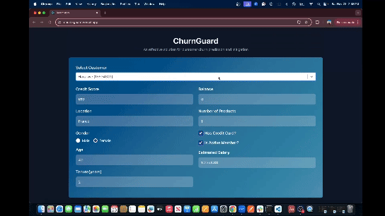

# :chart:ChurnGuard - A Solution for Customer Churn Prediction and Mitigation

## :books:About
ChurnGuard is a web application designed to predict customer churn and provide actionable insights to retain at-risk customers. By leveraging advanced machine learning and generative AI, ChurnGuard empowers businesses to reduce churn and strengthen customer relationships.

<div align="center">
  <h3>ChurnGuard Dashboard</h3>
  
</div>

## :video_camera:Deployed App Demo on youtube
<div align="center">
  <a href="https://youtu.be/NQAymmtNgfo">
    
  </a>
</div>

## :rocket:Technologies
### Front-End


### Back-End 


### Other Tools/ Machine Learning + Generative AI 


### Deployment


## :gear: Features

 Predict churn probabilities using ML models

 Detailed explanations of why a customer is at risk of churning, powered by Google’s Gemma2

 Automatically generate customer-specific emails to incentivize loyalty

 Interactive visualizations including:

 Displays average churn probability

 Bar chart of churn probabilities from individual ML models

 Bar chart showing percentile rank among peers

## :rocket: Machine Learning Workflow

 
  - Bank customer dataset from Kaggle

 
  - The dataset was split into 80/20 ratio (80% for training and 20% for testing)

  
  - Performed feature selection, transformation, and creation to enhance the dataset
  - Addressed class imbalance using SMOTE to oversample the minority class

 
  - XGBoost  
  - k-Nearest Neighbors  
  - Gradient Boosting  
  - ExtraTrees  
  - AdaBoost  


  - Implemented **voting classifiers**, **stacking**, and **bagging** to combine the strengths of multiple models and improve predictive performance 

  
  - **Accuracy**: 0.851500  
  - **Recall**: 0.62
  - In the context of ChurnGuard, recall is a critical metric because it measures the model's ability to correctly identify customers who are at risk of churning and the cost of false negatives is much higher than the cost of false positives
     
## :computer: Application Architecture


 - Built with **React** for an intuitive and dynamic user experience
 - Deployed on **Vercel** for scalability and reliability


 - Powered by **Flask**, which handles API services and integrates with AI tools
 - Deployed on **Render** for seamless performance


 - Google’s **Gemma2** generates:
   - Explanations for churn predictions
   - Personalized emails to incentivize at-risk customers

## :sparkles:Getting Started
### Prerequisites


### Installation
1. Clone the repo.
```sh
  git clone https://github.com/Pallavi25Kishore/Rhythm.git
```

2. Install NPM packages.
```sh
  npm install
```

3. Make a copy of the .exampleenv file and rename it to .env. Enter the following in the .env file.
```sh
PORT = PORT
DB_HOST = "host name"
DB_USER = "username"
DB_NAME = "name of database"
DB_PASSWORD = "password"
DB_PORT = DB PORT
```

4. Run in dev environment.
```sh
  npm run server-dev
  npm run react-dev
```


